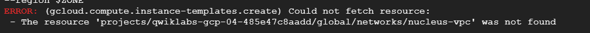

# Task 1. Create a project jumphost instance

first we will add this code in cloud shell . note (replace with the provided informaions i nyour lab )

```sh
export INSTANCE=[your instance name]
export PORT_NO=[your port num]
export FIREWALL=[your firewall]
export ZONE=[your zone] #will be in task 1 section
export REGION=[your region] # extract it from the zone
```

- here we make this variables global in our project to use them later

1 - we will make the network to use it later

```sh
gcloud compute networks create nucleus-vpc --subnet-mode=auto
```

2 - create the instance

```sh
gcloud compute instances create $INSTANCE \
    --zone=$ZONE \
    --machine-type=e2-micro
```

# Task 2. Set up an HTTP load balancer

1 - the following code to configure the web servers

```sh
cat << EOF > startup.sh
#! /bin/bash
apt-get update
apt-get install -y nginx
service nginx start
sed -i -- 's/nginx/Google Cloud Platform - '"\$HOSTNAME"'/' /var/www/html/index.nginx-debian.html
EOF

```

2- Create an instance template.

```sh
gcloud compute instance-templates create web-server-template \
--metadata-from-file startup-script=startup.sh \
--network nucleus-vpc \
--machine-type g1-small \
--region $ZONE
```

- if it gives you the following error
  

      recreate the network vpc in section 1 task 1

2 - Create a managed instance group based on the template.

```sh
gcloud compute instance-groups managed create web-server-group \
--base-instance-name web-server \
--size 2 \
--template web-server-template \
--region $REGION
```

3 - Create a firewall rule .

```sh
gcloud compute firewall-rules create $FIREWALL \
--allow tcp:80 \
--network nucleus-vpc
```

4 - Create a health check.

```sh
gcloud compute http-health-checks create http-basic-check
```

5 -Create a backend service and add your instance group as the backend to the backend service group with named port (http:80)

```sh
gcloud compute instance-groups managed \
       set-named-ports web-server-group \
       --named-ports http:80 \
       --region $REGION
```

```sh

gcloud compute backend-services create web-server-backend \
       --protocol HTTP \
       --http-health-checks http-basic-check \
       --global
```

```sh
gcloud compute backend-services add-backend web-server-backend \
       --instance-group web-server-group \
       --instance-group-region $REGION \
       --global
```

6 - Create a URL map, and target the HTTP proxy to route the incoming requests to the default backend service.

```sh
gcloud compute url-maps create web-server-map \
       --default-service web-server-backend
```

```sh
gcloud compute target-http-proxies create http-lb-proxy \
       --url-map web-server-map
```

7 - Create a forwarding rule.

```sh
gcloud compute forwarding-rules create http-content-rule \
     --global \
     --target-http-proxy http-lb-proxy \
     --ports 80
```

```sh
gcloud compute forwarding-rules create $FIREWALL \
     --global \
     --target-http-proxy http-lb-proxy \
     --ports 80
```

```sh
gcloud compute forwarding-rules list

```

note

wait from 5 to 7 minutes and then check the task to get the score.

if you want any help . you can message me here

hafz7060@gmail.com

[EngMahmoudHafez](https://www.linkedin.com/in/engmahmoudhafez/)
